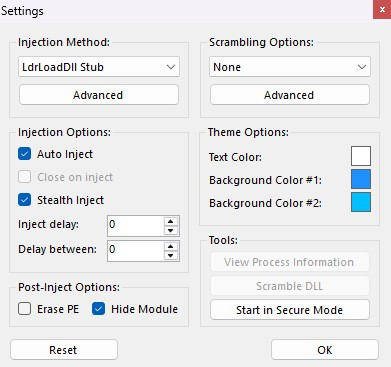
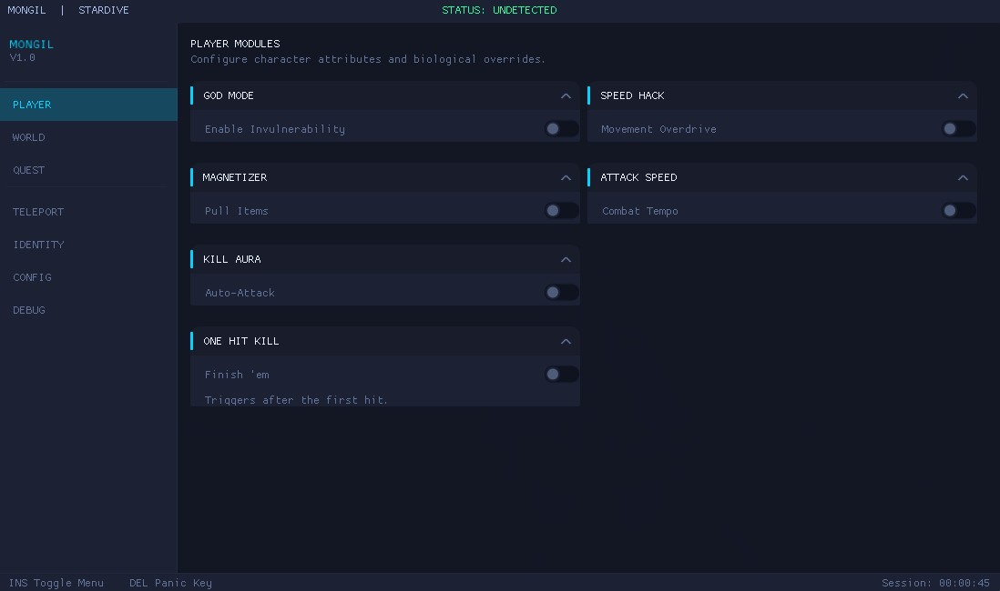
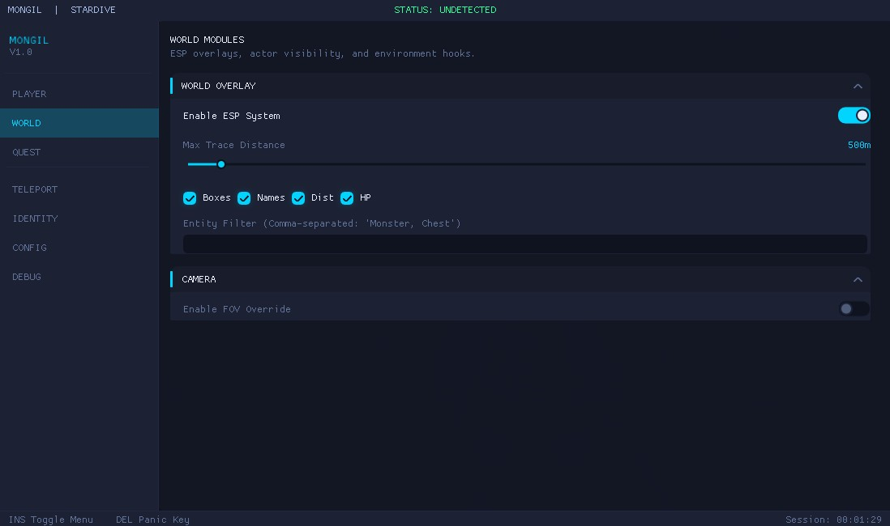
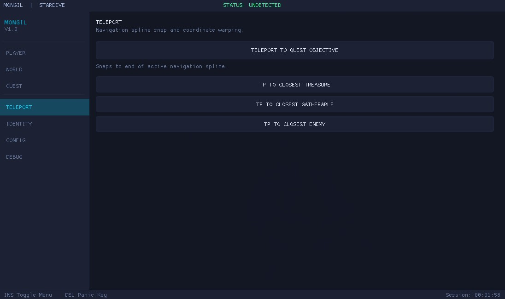

# Project GHOST - Mongil Star Dive Internal

Make Sure To Join Discord Server Where I will be Releasing New Versions + Neverness To Everness and Other Games Cheats : https://discord.gg/p7e7rwQJF4

## Disclaimer
This project is created and shared for educational purposes only. I do not condone or endorse the use of this project for any illegal activities or unethical behavior. The use of this project is solely at the user's discretion. I am not held responsible for any misuse of the information or code provided in this repository.

If my injector doesnot work then download the xignsilencer and run it and also download injector of your choice or extreme injector : https://www.unknowncheats.me/forum/downloads.php?do=file&id=21570

## Usage
### How to Run
Make sure to set Directx to 11 in the Game Settings First.
1. Run the Ghost Injector as Admin First.
2. Now Run the Game using Netmarble Launcher.
3. Press **INSERT** to show the menu.
4. Use **DELETE** to panic unload the trainer.

## Features
*   **God Mode**: Authoritative invulnerability and HP lock.
*   **Kill Aura**: Automatically pulses damage to all enemies within range.
*   **One Hit Kill**: Forced damage multipliers for instant eliminations.
*   **Mob Vacuum**: Magnetizer pulls all nearby enemies into a stack.
*   **ESP (Universal)**: 3D Boxes, Names, Distance, and HP for Enemies, Chests, and Gathers.
*   **Entity Blacklist**: Comma-separated filter to hide specific objects from ESP.
*   **Fov Changer**: Adjustable field of view from 60 to 160 degrees.
*   **Quest Warper**: Instant teleport to active mission objectives.
*   **TP To Enemy**: Warps to the closest monster.
*   **TP To Treasure**: Warps to the closest chest.
*   **TP To Gatherable**: Warps to the closest plant or ore.
*   **Dialogue Skip**: Auto-advance and skip all game conversations instantly.
*   **Untargetable**: Stop Enemies targeting you (Combat tab).
*   **Long Range Interaction**: Loot Chests,Plants and talk to NPCs from distance (World tab).

## Screenshots

